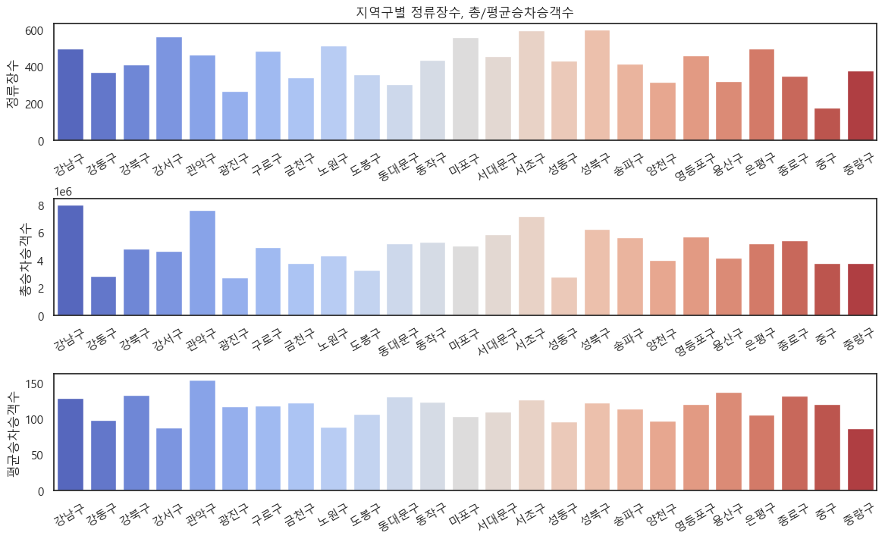
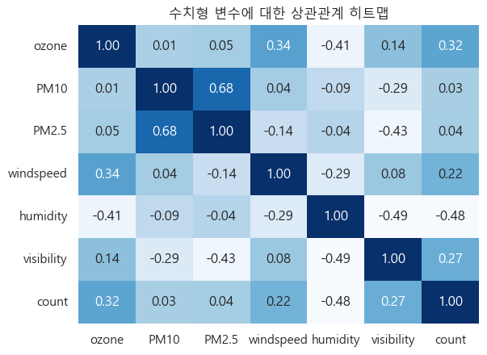

# KT 에이블스쿨 미니프로젝트 (1)

* 2023년 1월 31일부터 7월 18일까지 KT 에이블스쿨 부트캠프에서 진행한 미니프로젝트들입니다.

## 목차

1. [서울시 생활정보 기반 대중교통 수요 분석](#mini-1-1)

2. [날씨데이터 기반 서울시 공유자전거 따릉이 수요 예측](#mini-1-2)

3. [공공데이터를 활용한 미세먼지 농도 예측](#mini-2-1)

4. [악성사이트 탐지 머신러닝 모델 개발](#mini-2-2)

---
---

## mini 1-1

### 서울시 생활정보 기반 대중교통 수요 분석

* 목표
    - 생활정보를 분석하여 버스 정류장 또는 노선의 신설이 필요한 곳을 탐색

* 데이터
    - 1 구별 버스 통계 데이터
    - 2 행정구 인구 이동 데이터
    - 3 주민등록인구 데이터
    - 4 사업체분포 데이터

* 배운 점
    - matplotlib 와 seaborn 을 활용한 데이터 시각화
    - 각기 다른 데이터를 병합하고 분석하기

|정류장/노선|출발시군구|시간x인구|유동인구/평균정류장|
|-|-|-|-|
|1.7282|중구|3.5억|2.02억|
|5.4835|강남구|0.7억|1.4억|
|3.3019|종로구|3.4억|1.03억|
|4.6400|영등포구|4.2억|0.91억|
|7.5636|송파구|5.9억|0.77억|
 
* 인사이트
    #### **중구, 강남구, 종로구, 영등포구, 송파구**
    평균 정류장 수는 적은 반면, 유동인구는 많아 대중교통의 공급이 필요한 상위 5개 지역구는 위와 같다.

    <a href=#kt-에이블스쿨-미니프로젝트-1>
        <strong>Top 🔝</strong>
    </a>

---
## mini 1-2

### 날씨데이터 기반 서울시 공유자전거 따릉이 수요 예측

* 목표
    - 어떠한 날씨요소가 따릉이 수요와 관련 있는지 분석 및 인사이트 도출

* 데이터
    - 1 서울기상관측 및 따릉이 대여 데이터

* 배운 점
    - 단변량, 이변량 분석
    - 상관 분석, t-test 를 통한 가설 검정 기법
    

* 인사이트
    - 오존 농도, 풍속, 가시성이 높을수록, 습도가 낮을수록 자전거 대여량이 약간 많아진다.
    - 봄이나 여름보다는 가을에 자전거 대여량이 많아진다.

    <a href=#kt-에이블스쿨-미니프로젝트-1>
        <strong>Top 🔝</strong>
    </a>

---
## mini 2-1

### 공공데이터를 활용한 미세먼지 농도 예측

* 목표
    - 공공 데이터를 기반으로 머신러닝을 통해 미세먼지의 농도 예측

* 데이터
    - 1 air_2021.csv : 2021년 미세먼지 데이터
    - 2 air_2022.csv : 2022년 미세먼지 데이터
    - 3 weather_2021.csv : 2021년 날씨 데이터
    - 4 weather_2022.csv : 2022년 날씨 데이터
  
    - Train 데이터 : 2021년의 미세먼지 농도 데이터
    - Test 데이터 : 2022년의 미세먼지 농도 데이터

* 배운 점
    - 시계열 데이터의 Feature Engineering 방법
    - 다양한 모델(선형회귀, KNN, 랜덤포레스트, 그라디언트 부스팅)을 통한 회귀분석

* 모델링

|
Model
|
MSE
|
RMSE
|
R2 Score
|
|-|-:|-:|-:|
|LinearRegression|37.033|6.085|0.933|
|KNeighborsRegressor|66.504|8.155|0.880|
|RandomForestRegressor|38.827|6.231|0.930|
|GradientBoostingRegressor|37.803|6.148|0.932|
|LR_DataSplit|40.447|6.360|0.927|

    <a href=#kt-에이블스쿨-미니프로젝트-1>
        <strong>Top 🔝</strong>
    </a>

---

## mini 2-2

### 악성사이트 탐지 머신러닝 모델 개발

* 목표
    - 1 웹 페이지에서 Feature를 추출
    - 2 악성사이트 여부를 판별하는 성능 좋은 AI모델을 생성

* 데이터
    - 1 정상 사이트와 악성 사이트의 웹 크롤링 데이터

* 배운 점
    - 데이터의 특성을 고려하는 Feature Engineering
    - 수치형, 범주형 데이터의 단변량 분석과 이변량 분석 기법
    - Tensorflow ANN 모델링
    - 스케일링 전/후 성능 비교

* 모델링
    
|
Model
|
F1 Score
|
Accuracy Score
|
|-|-:|-:|
|**LogisticRegression**|85.60|85.67|
|**LogisticRegression_Scaled**|86.29|86.08|
|**RandomForest**|93.54|93.51|
|**RandomForest_Scaled**|93.63|93.61|
|**Tensorflow_ANN**|91.69|91.86|
|**Tensorflow_ANN_Scaled**|92.34|92.27|

    <a href=#kt-에이블스쿨-미니프로젝트-1>
        <strong>Top 🔝</strong>
    </a>

---
